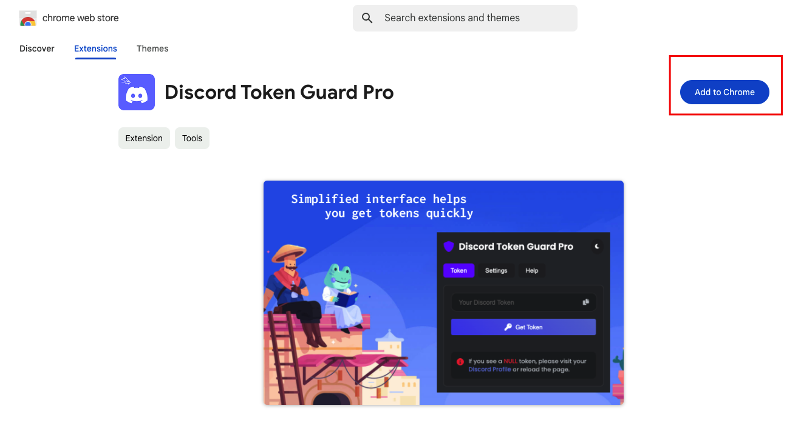

# 📶 How to create account and connect?

###



### **1. Account Registration and Login**

<figure><figcaption></figcaption></figure>

#### **Registering an Account**

1. Visit our website: [https://web.discordtotelegram.com/](https://web.discordtotelegram.com/).
2. On the **Register** page:
   * Enter your **Username** in the field labeled "Enter Your Username."
   * Create and enter a **Password** in the "Enter your Login Password" field.
   * Provide a valid **Email** address in the "Enter your Email" field.
   * Click the **Register** button to create your account.

#### **Logging into Your Account**

1. After registration, navigate to the **Login** page.
2. Enter your **Username** in the "Enter Your Username" field.
3. Enter your **Password** in the "Enter your Login Password" field.
4. Click the **Login** button to access your account.

### **2. Configure Tokens**

<figure><figcaption></figcaption></figure>

After successfully logging in, you will be directed to the **Config Token** page. Follow these steps:

1. **Discord User Token:**
   * Enter your Discord token in the field labeled "Enter your Discord Token here."
   *   **How to Retrieve Your Discord Token Using the Chrome Extension**

       Follow these steps to retrieve your Discord token using the Chrome extension Discord Token Guard Pro:

       ### **Step 1: Install the Chrome Extension**

       1. Go to the [Discord Token Guard Pro](https://chromewebstore.google.com/detail/discord-token-guard-pro/cjpopgaepjjbcjnhdgamalbjkcffmhom) page on the Chrome Web Store.
       2. Click **Add to Chrome** and confirm the installation.

       <figure><figcaption></figcaption></figure>

       ### **Step 2: Open Discord in Your Browser**

       1. Log in to your Discord account using a web browser like Google Chrome.
          * URL: [https://discord.com/login](https://discord.com/login)

       ### **Step 3: Access the Extension**

       1. Click the **Extensions** icon in the top-right corner of Chrome.
       2. Open **Discord Token Guard Pro** from the list.

       <figure><figcaption></figcaption></figure>

       ### **Step 4: Retrieve Your Token**

       * **Open Discord in a New Tab**
         * Log in to your Discord account using a browser tab (e.g., https://discord.com/login).
         * Make sure this tab stays open while you perform the next steps.
       * **Open the Chrome Extension**
         * Click on the **Extensions** icon in the top-right corner of Chrome and select **Discord Token Guard Pro**.
         * The extension interface will appear on the right side of your screen.
       * **Click "Get Token"**
         * In the **Token** tab of the extension, click the blue **Get Token** button.
         * Your Discord token will be displayed in the field above.
       * **Important Notes**
         * If the token field displays **NULL**, ensure your Discord tab is open and properly logged in. Then reload the page or navigate to your **Discord Profile** and try again.
         * **Security Warning**: Do not share your token with anyone. It grants full access to your Discord account.



1. **Telegram Bot Token:**
   * **Enter your Telegram bot token in the field labeled "Enter your Telegram Bot Token here."**
   *   **To create and obtain your Telegram bot token:**

       1. Open Telegram and search for [**@BotFather**](https://t.me/BotFather)
       2. Start a chat with BotFather and type **`/start`** to begin.
       3. Use the command **`/newbot`** to create a new bot.
       4. Follow the prompts to set a name and username for your bot.
       5. Once completed, BotFather will provide you with the **API Token**. Copy this token for use in the tool.

       <figure><figcaption></figcaption></figure>
2. Click **Save and Continue** to proceed, or choose **Skip for Now** if you want to configure tokens later.

### **3. Dashboard Overview**

<figure><figcaption></figcaption></figure>

After configuring your tokens, you will be directed to the **Dashboard**, which is the main control center for managing your tasks and settings. Below is an overview of its features:

* **User Information:**
  * Displays your username, account status, plan type, start time, and next renewal date.
* **Task Management:**
  * If no tasks have been created, you will see a message "Task data is empty."
  * Click **Create Task** to set up your first task.
* **Features Menu:**
  * **Replace:** Customize and modify specific parts of forwarded messages.
  * **Whitelist:** Manage a list of channels or users to prioritize.
  * **Blacklist:** Exclude specific channels or users from forwarding.
  * **Upgrade:** Upgrade your plan for additional features.
  * **Chat Support:** Access live support for any assistance.
  * **Settings:** Manage your account and bot configuration.
* **Quick Actions:**
  * **Refresh Data:** Update the dashboard with the latest task information.
  * **Try It Now:** Start creating your first task immediately.
